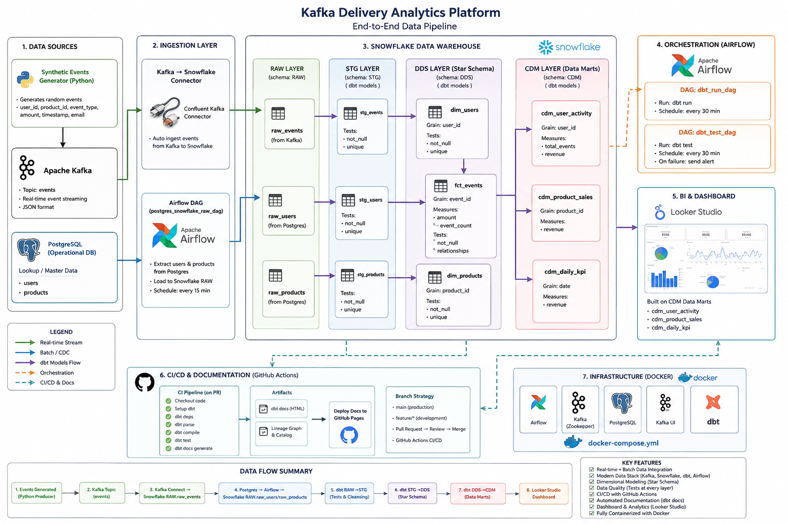
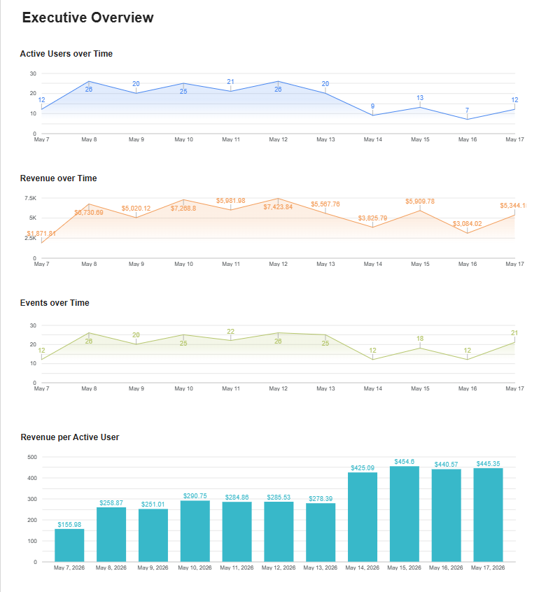
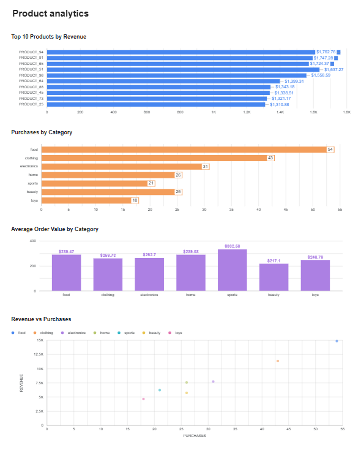
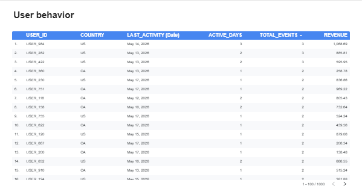
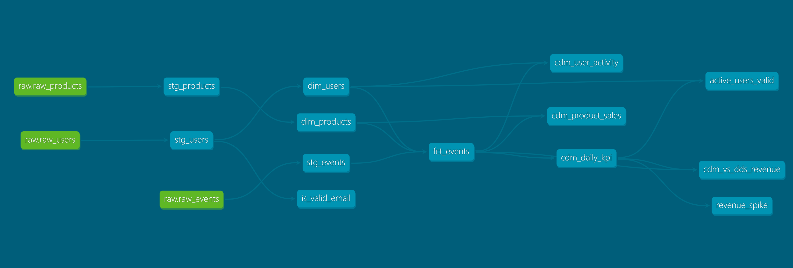

# Kafka Delivery Analytics Platform

End-to-end modern Data Engineering project built with **Kafka**, **Snowflake**, **Airflow**, **dbt**, **Docker**, and **Looker Studio**.

This project simulates a real-world analytics platform for a delivery application with both **real-time streaming data** and **batch ETL pipelines**.

---

# Project Architecture



---

# Tech Stack

| Layer | Technology |
|---|---|
| Streaming | Apache Kafka |
| Data Warehouse | Snowflake |
| Orchestration | Apache Airflow |
| Data Transformation | dbt |
| Source Systems | PostgreSQL + Kafka |
| Containerization | Docker / Docker Compose |
| BI & Visualization | Looker Studio |
| CI/CD | GitHub Actions |
| Programming Language | Python |

---

# Project Overview

The platform processes delivery application events in real time and combines them with operational data stored in PostgreSQL.

The pipeline includes:

- Real-time event streaming with Kafka
- Batch ingestion with Airflow
- Data warehouse modeling with dbt
- Star schema design (DDS layer)
- Business data marts (CDM layer)
- Automated testing & documentation
- CI/CD with GitHub Actions
- Dashboarding with Looker Studio

---

# Data Flow

## 1. Event Generation

A custom Python producer generates synthetic delivery events:

- user activity
- purchases
- sessions
- platform interactions
- revenue events

Example event fields:

```json
{
  "event_id": "evt_1001",
  "user_id": "user_15",
  "product_id": "product_8",
  "event_type": "purchase",
  "amount": 49.99,
  "currency": "USD",
  "event_timestamp": "2026-05-20 10:15:00"
}
```

Events are streamed into Kafka in real time.

---

## 2. Kafka → Snowflake Streaming

Kafka events are automatically loaded into Snowflake using the Kafka Snowflake Connector.

### RAW Layer

Schema: `RAW`

Tables:

- `raw_events`
- `raw_users`
- `raw_products`

---

## 3. PostgreSQL → Snowflake Batch ETL

Additional master data (`users` and `products`) is stored in PostgreSQL.

An Airflow DAG incrementally extracts and loads this data into Snowflake RAW tables.

### Airflow DAG

- Extract users/products from PostgreSQL
- Incremental loading
- Load into Snowflake RAW layer

---

# dbt Data Modeling

The project follows a layered warehouse architecture:

```text
RAW → STG → DDS → CDM
```

---

# STG Layer

Purpose:

- data cleaning
- deduplication
- standardization
- validation

Example transformations:

- filtering invalid events
- removing duplicates
- type casting
- handling null values

Example deduplication logic:

```sql
QUALIFY ROW_NUMBER() OVER (
    PARTITION BY event_id
    ORDER BY load_timestamp DESC
) = 1
```

---

# DDS Layer (Star Schema)

The DDS layer contains the analytical data model.

## Fact Table

### `fct_events`

Measures:

- revenue
- event counts
- transactions

Incremental dbt model:

```sql
{{ config(
    materialized='incremental',
    unique_key='event_id'
) }}
```

---

## Dimension Tables

### `dim_users`

User attributes and surrogate keys.

### `dim_products`

Product catalog and product dimensions.

---

# CDM Layer (Business Data Marts)

The CDM layer contains business-ready aggregated tables.

## Data Marts

| Model | Description |
|---|---|
| `cdm_daily_kpi` | Daily business KPIs |
| `cdm_product_sales` | Product performance analytics |
| `cdm_user_activity` | User engagement analytics |

---

# Data Quality & Testing

dbt tests are implemented across all layers.

## Built-in Tests

- `not_null`
- `unique`
- `relationships`
- `accepted_values`

## Custom Tests

Examples:

- valid email validation
- revenue spike detection
- active users validation

---

# Airflow Orchestration

Airflow is responsible for:

- PostgreSQL ingestion DAGs
- dbt execution
- dbt testing
- scheduling workflows

## dbt DAG

The Airflow DAG runs:

```bash
dbt run
dbt test
```

on a schedule.

---

# Dashboard & Analytics

Business dashboards were built in Looker Studio using the CDM data marts.

## Executive Overview



---

## Product Analytics



---

## User Behavior Analytics



---

# CI/CD Pipeline

GitHub Actions is used for Continuous Integration.

## CI Workflow

The pipeline automatically runs on:

- push to main
- pull requests

### Automated Checks

- dbt parse
- dbt compile
- dbt docs generate
- project validation

---

# dbt Documentation

The project automatically generates dbt documentation and lineage graphs.

Includes:

- model lineage
- column descriptions
- tests
- dependencies
- business metadata

---

# Infrastructure

The entire platform runs inside Docker containers.

## Services

- Airflow
- Kafka
- Zookeeper
- PostgreSQL
- dbt
- Snowflake Connector

Managed with:

```bash
docker-compose up
```

---

# Repository Structure

```text
kafka-delivery-project/
│
├── dags/                  # Airflow DAGs
├── delivery_dwh/          # dbt project
│   ├── models/
│   │   ├── staging/
│   │   ├── dds/
│   │   └── marts/
│   ├── tests/
│   └── macros/
│
├── kafka/
│   ├── producer/
│   └── connector/
│
├── architecture/          # Architecture diagrams & dashboard screenshots
├── docker-compose.yml
└── requirements.txt
```

---

# Key Features

- Real-time + batch data integration
- Incremental ETL pipelines
- Star schema modeling
- Automated data quality checks
- CI/CD with GitHub Actions
- Fully containerized infrastructure
- dbt documentation & lineage
- Business dashboards

---

# Future Improvements

Potential next steps:

- Kubernetes deployment
- Terraform infrastructure
- dbt snapshots
- SCD Type 2 dimensions
- Great Expectations integration
- Monitoring & alerting
- Streaming transformations with Spark

---

# Author

Denis Evmenenko

LinkedIn: https://www.linkedin.com/in/denis-evmenenko/

GitHub: https://github.com/evmenenkode

---

# Screenshots

## dbt Lineage Graph



---

# License

MIT License
